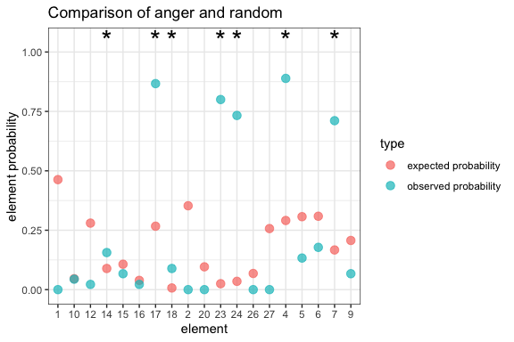
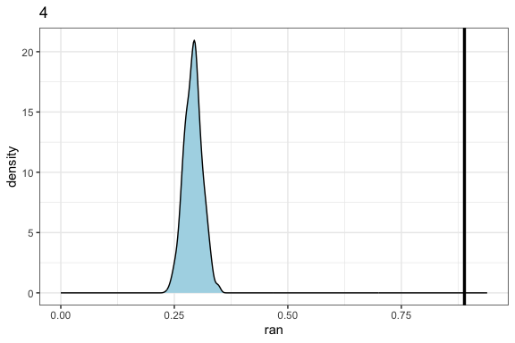
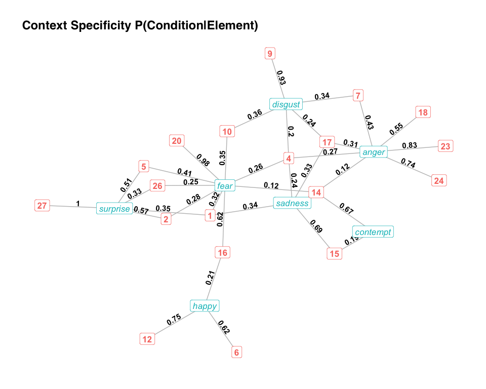
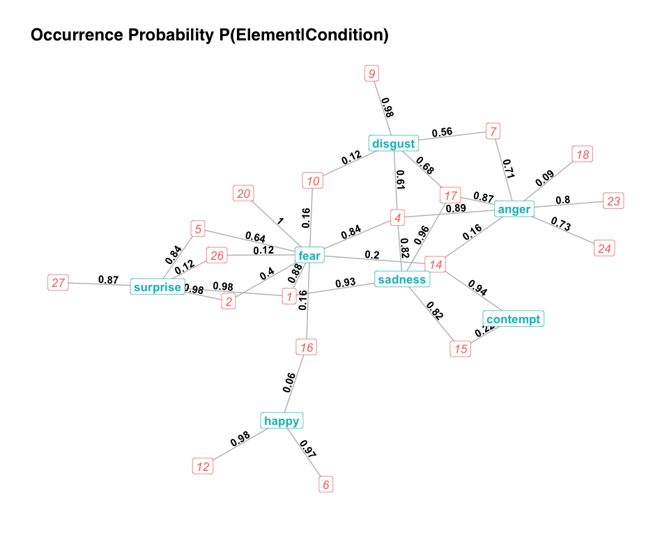
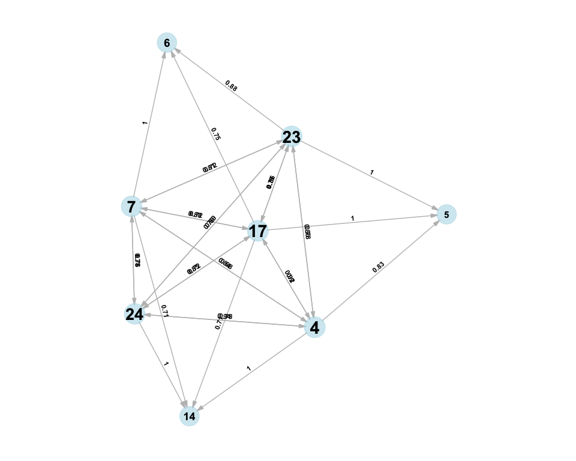
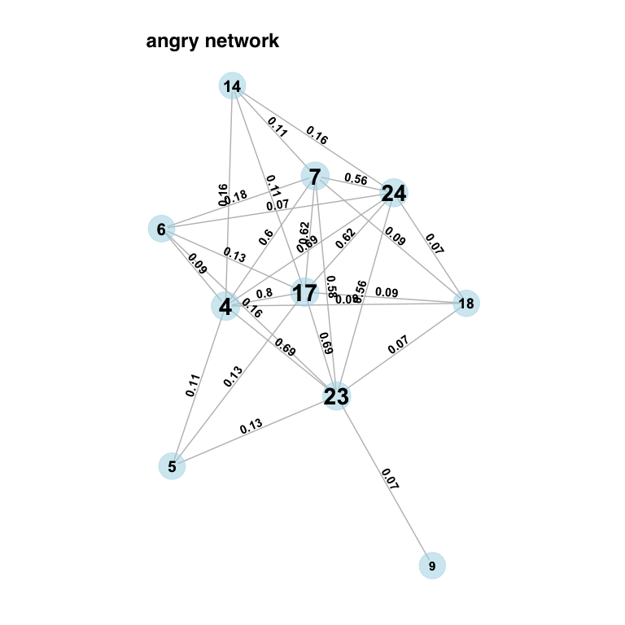
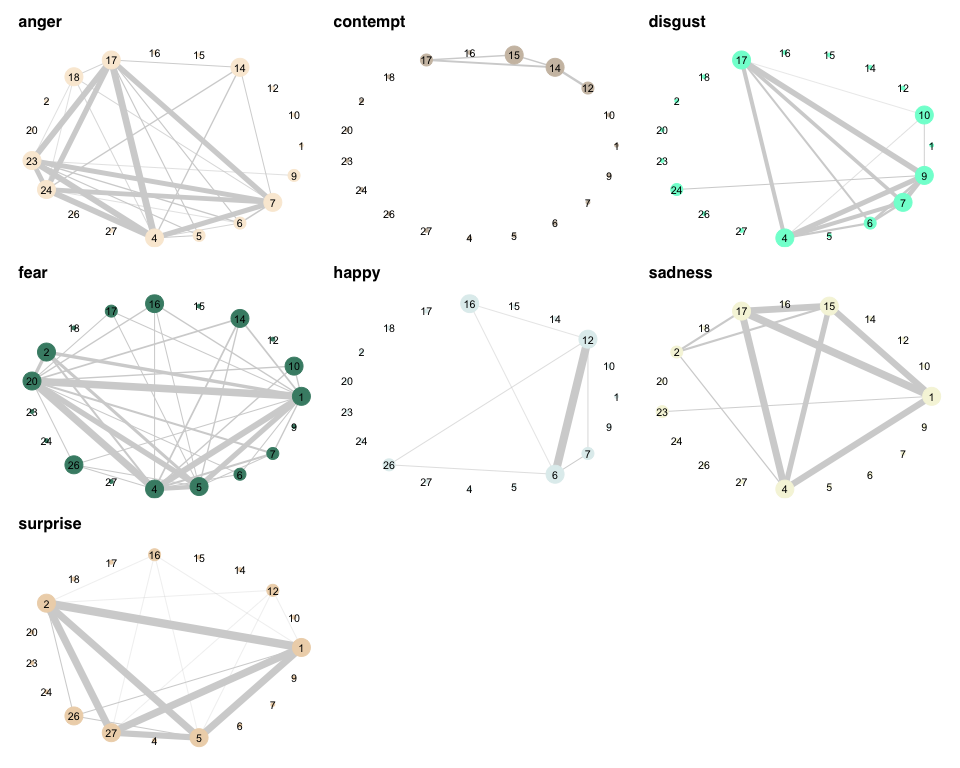
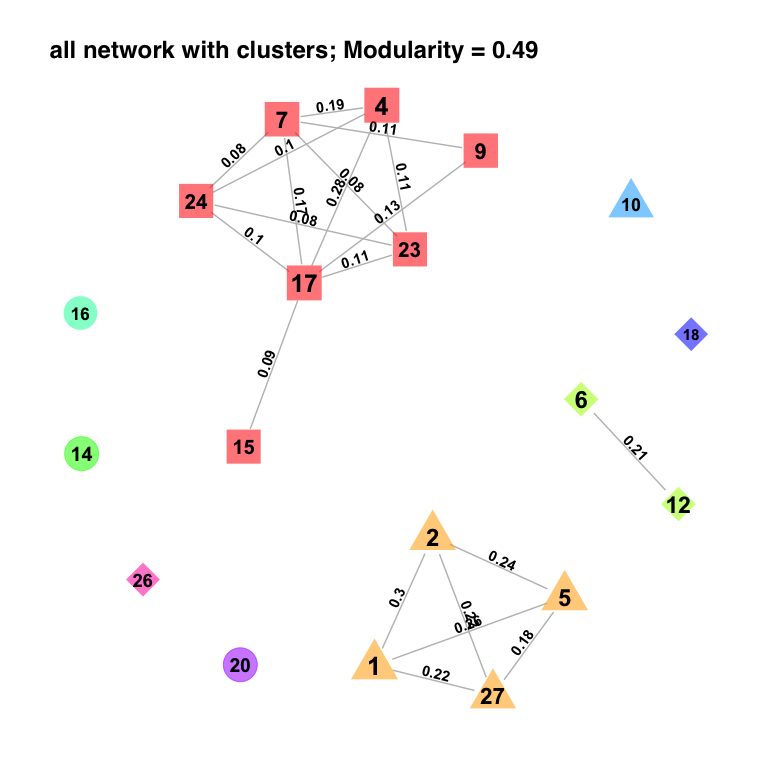
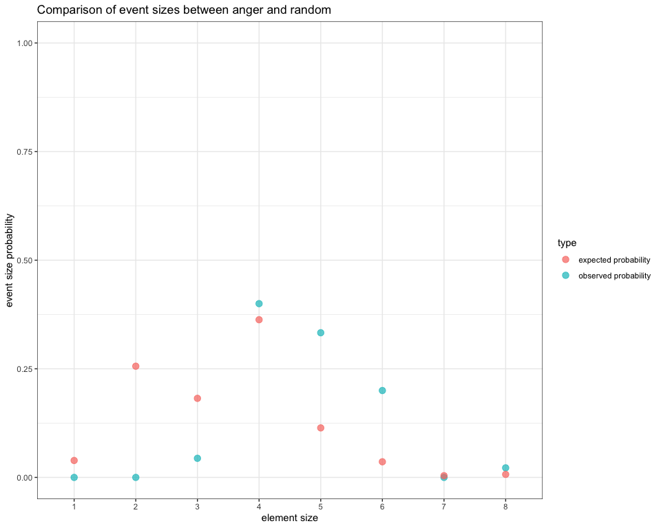

<!-- README.md is generated from README.Rmd. Please edit that file -->

# Introduction

The NetFACS package is a tool that allows users to analyse and plot
their facial signal data, generated using the Facial Action Coding
System (FACS), in a statistical meaningful way using network analysis.
FACS data, based on the co-occurrence of different elements representing
facial muscle movements (called ‘Action Units’ or AUs), have some rather
awkward properties: single AUs are binary (present/absent), they are
part of larger expressions and combined with each other, their use can
be non-normally distributed, individuals can provide multiple
datapoints, data are often autocorrelated etc (see [Mielke et al.,
2021](https://doi.org/10.3758/s13428-021-01692-5) for more information).
NetFACS allows users to overcome some of these problems and present
their results in a form that is easy to communicate to other
researchers.

This is a tutorial and overview over which functions are currently
available in the NetFACS package and which questions we can potentially
already answer. NetFACS at this point is still work in progress. We will
demonstrate the whole process of creating a NetFACS object, and explain
the existing analytical and plotting tools. Currently, all functions are
concerned with co-occurrence, so which elements happen simultaneously.
Time-series analyses should follow soon. While we will use mainly Facial
Action Coding System examples throughout (meaning ‘elements’ in the
functions are Action Units, or AU), the functions can be applied to any
co-occurrence data, so other questions regarding communication are also
possible. This allows researchers to directly compare the complexity of
different communication systems, e.g. gestures and facial expressions in
nonhuman primates.

In this tutorial, we will mainly talk about FACS and emotions, simply
because this has been historically the area where FACS has been employed
the most. However, the main goal is to open up the use of FACS to other
topics. So, whenever the ‘context’ here is ‘emotion’, any other context
can be chosen: different experimental interventions, behavioural
contexts, or different groups of participants.

### NetFACS basics

As the name indicates, NetFACS is based on the use of networks for FACS
data. Not all analyses require an understanding of networks: at its most
basic, NetFACS can simply represent the probabilities that Action Units
occur in a context or not, or contrast AU use between two conditions.
Networks become interesting once we talk about the connections between
Action Units, or the connections between AUs and contexts that goes past
the pure occurrence. All analyses are based on different concepts of
probability, which are explained below. Probabilities are used to
quantify the strength of connection between AUs, and between AUs and
contexts. The third pillar of the package, next to networks and
probabilities, are two different resampling methods: permutations and
bootstrapping. These are used to determine what occurrence of AUs would
be expected under random circumstances or if the data were taken from a
different population. We will explain their use further down, but it’s
important to understand the distinction. In permutations, existing data
are shuffled to create the ‘random’ probability that two AUs co-occur,
for example. In bootstraps, subsets of data from a different context are
selected over and over again for the same purpose.

NetFACS is based mainly on different probabilities: unconditional
probability is the simply the proportion of occurrence;
$P(A \\cap B) = \\frac{number of occurrences A+B}{number of possible occurrences A+B}$).
The unconditional probability of a combination AB is not directional,
i.e. it is the same for AB as it is for BA: (*P*(*A*∩*B*) ==
*P*(*B*∩*A*)). We use the unconditional probability mainly to express
how often an AU or a combination of AUs occurs at all, either in the
whole data set or in a specific context. Conditional probability, on the
other hand, is the probability of an event A given an event B;
$P(A \\mid B) = \\frac{P(A \\cap B)}{P(B)}$). Thus, it tells us not how
often A occurs at all, but how often A occurs in the subset of cases
where we know that B is present. Therefore, the conditional
probabilities can differ depending on which direction we are looking at
(*P*(*A*∣*B*) != *P*(*B*∣*A*)). For example, in the English language,
the letter ‘h’ is often accompanied by the letter ‘s’, but the reverse
is not true: most cases of ‘s’ do not involve ‘h’. We can explore the
conditional probability between two elements, or between an
element/combination and a context. Probabilities are used as they are
intuitive for most people, in contrast to many more opaque association
indices that are often used in social network analysis. It also means
that we can tie in other analytical tools that are very directly based
on probabilities, such as Bayesian models and Markov Chains.

### Install the package

Let’s start by installing the package and loading the library.

``` r
# install NetFACS from CRAN
install.packages("NetFACS")

# read library
library(NetFACS)
```

Alternatively, you can install the latest development version of NetFACS
from GitHub with:

``` r
# install NetFACS from GitHub
devtools::install_github("NetFACS/NetFACS")
```

## Data sets

Currently, there are two practice data sets in the package: one is the
Extended Cohn-Kanade Database for posed FACS data (all basic AUs, 7
emotions) ([Lucey et
al. 2010](https://doi.org/10.1109/CVPRW.2010.5543262)), where
co-occurrence is defined as Action Units happening in the same facial
expression, and one is the Communist Manifesto in French, German, and
English, where co-occurrence is defined as letters happening in the same
word. These can be accessed the following way:

``` r
data("letternet") # this is the Manifesto #
data("emotions_set") # this is the CK Database #
```

Important for the NetFACS package at the moment is that the basic data
used to calculate probabilities are stored in a data frame with each
event as a row (this can be a communication sequence, a facial
expression, a frame in a video, or a word, for example), and each
element as a column (for example, Action Units in FACS data or letters
for words). Elements get a 0 if they are absent in this event, and a 1
if they are present. So, for example, the word ‘word’ would have a 1 in
the columns for d,o,r, and w, and 0 in all other letter columns. It’s
usually good to have a second data frame of the same length that
contains additional information about the condition, duration, etc. This
will look like this for the words:

|   a |   b |   c |   d |   e |   f |   g |   h |   i |   j |   k |   l |   m |   n |   o |   p |   q |   r |   s |   t |   u |   v |   w |   x |   y |   z |
|----:|----:|----:|----:|----:|----:|----:|----:|----:|----:|----:|----:|----:|----:|----:|----:|----:|----:|----:|----:|----:|----:|----:|----:|----:|----:|
|   0 |   0 |   0 |   0 |   1 |   0 |   0 |   0 |   1 |   0 |   0 |   0 |   0 |   1 |   0 |   0 |   0 |   0 |   0 |   0 |   0 |   0 |   0 |   0 |   0 |   0 |
|   0 |   0 |   0 |   0 |   1 |   0 |   1 |   0 |   0 |   0 |   0 |   0 |   0 |   1 |   0 |   1 |   0 |   0 |   1 |   1 |   0 |   0 |   0 |   0 |   0 |   0 |
|   0 |   0 |   0 |   0 |   1 |   0 |   1 |   1 |   0 |   0 |   0 |   0 |   0 |   0 |   0 |   0 |   0 |   0 |   0 |   1 |   0 |   0 |   0 |   0 |   0 |   0 |
|   0 |   0 |   0 |   0 |   0 |   0 |   0 |   0 |   0 |   0 |   0 |   0 |   1 |   0 |   0 |   0 |   0 |   0 |   0 |   0 |   1 |   0 |   0 |   0 |   0 |   0 |
|   0 |   0 |   0 |   0 |   0 |   0 |   0 |   0 |   1 |   0 |   0 |   0 |   0 |   1 |   0 |   0 |   0 |   0 |   0 |   0 |   0 |   0 |   0 |   0 |   0 |   0 |
|   1 |   0 |   0 |   0 |   1 |   0 |   0 |   0 |   0 |   0 |   0 |   0 |   0 |   0 |   1 |   1 |   0 |   1 |   0 |   0 |   1 |   0 |   0 |   0 |   0 |   0 |

Letter data for words in the Communist Manifesto

| word     | comb.size | sentence | language |
|:---------|----------:|---------:|:---------|
| ein      |         3 |        1 | german   |
| gespenst |         8 |        1 | german   |
| geht     |         4 |        1 | german   |
| um       |         2 |        1 | german   |
| in       |         2 |        1 | german   |
| europa   |         6 |        1 | german   |

Additional information for Communist Manifesto

### Prepare the data

Users who code FACS data will often have them stored in a different
format, where they have the Action Unit together with its start and end
time or duration in a specific video. The package has a function that
can deal with these data and transform them into the right format, as
long as they contain information about the video from which they were
taken.

So, for photos, data will sometimes look like this:

``` r
odd.photo <- data.frame(
  photo = c("photo1", "photo2", "photo3", "photo4", "photo5", "photo6"),
  AUs = c(
    "AU1/AU5/AU9",
    "AU1/AU2",
    "AU1/AU2/AU10",
    "AU1/AU2",
    "AU5/AU17/AU18",
    "AU6/AU12"
  )
)
kable(odd.photo, row.names = FALSE, caption = "Photo Data")
```

| photo  | AUs           |
|:-------|:--------------|
| photo1 | AU1/AU5/AU9   |
| photo2 | AU1/AU2       |
| photo3 | AU1/AU2/AU10  |
| photo4 | AU1/AU2       |
| photo5 | AU5/AU17/AU18 |
| photo6 | AU6/AU12      |

Photo Data

Videos, on the other hand, will sometimes look this:

``` r
odd.video <- data.frame(
  video = c(rep("video 1", 3),
            rep("video 2", 2),
            rep("video 3", 3)),
  AUs = c("AU1", "AU5", "AU9",
          "AU1", "AU2",
          "AU1", "AU2", "AU10"),
  start.times = c(0.1, 0.2, 0.3,
                  0.1, 0.3,
                  0.1, 0.4, 0.4),
  durations = rep(0.3, times = 8)
)
kable(odd.video, row.names = FALSE, caption = "Video Data")
```

| video   | AUs  | start.times | durations |
|:--------|:-----|------------:|----------:|
| video 1 | AU1  |         0.1 |       0.3 |
| video 1 | AU5  |         0.2 |       0.3 |
| video 1 | AU9  |         0.3 |       0.3 |
| video 2 | AU1  |         0.1 |       0.3 |
| video 2 | AU2  |         0.3 |       0.3 |
| video 3 | AU1  |         0.1 |       0.3 |
| video 3 | AU2  |         0.4 |       0.3 |
| video 3 | AU10 |         0.4 |       0.3 |

Video Data

The prepare.netfacs() function can take either of these inputs and turn
them into the right format. This will look something like this:

``` r
au.prepared <- prepare.netfacs(
  elements = odd.video$AUs,
  type = "video",
  video.id = odd.video$video,
  start.time = odd.video$start.times,
  duration = odd.video$durations,
  frame.duration = 0.05
)
kable(head(au.prepared$element.matrix),
      row.names = FALSE,
      caption = "Element Matrix of prepare.netfacs")
```

| AU1 | AU10 | AU2 | AU5 | AU9 |
|----:|-----:|----:|----:|----:|
|   1 |    0 |   0 |   0 |   0 |
|   1 |    0 |   0 |   0 |   0 |
|   1 |    0 |   0 |   1 |   0 |
|   1 |    0 |   0 |   1 |   0 |
|   1 |    0 |   0 |   1 |   1 |
|   1 |    0 |   0 |   1 |   1 |

Element Matrix of prepare.netfacs

``` r
kable(head(au.prepared$video.info),
      row.names = FALSE,
      caption = "Video Info of prepare.netfacs")
```

| video.id | start.sec | end.sec | duration |
|:---------|----------:|--------:|---------:|
| video 1  |      0.10 |    0.15 |     0.05 |
| video 1  |      0.15 |    0.20 |     0.05 |
| video 1  |      0.20 |    0.25 |     0.05 |
| video 1  |      0.25 |    0.30 |     0.05 |
| video 1  |      0.30 |    0.35 |     0.05 |
| video 1  |      0.35 |    0.40 |     0.05 |

Video Info of prepare.netfacs

# The ‘netfacs’ function

The basis for the whole package so far is the ‘netfacs’ function. The
function creates a list for all possible combination of elements that
has the information on their observed probability of occurrence in the
chosen data set. It also tests whether this observed probability is
significantly different from an expected or null distribution, and gives
information about the shape of that null distribution. The user defines
whether this null distribution is the expected random distribution of
elements (e.g., do AU1 and AU2 occur together more than expected by
chance) based on permutations of the raw data that control for the
overall probability of single elements occurring and the number of
elements per event, or whether we are comparing two conditions (e.g., do
AU1 and AU2 occur together more in sad than in angry faces) with one
condition providing the null condition. In the latter case, bootstraps
of the null condition are used to establish the null distribution.
Bootstraps can be done by randomly selecting events, or by randomly
selecting on a higher-level variable, e.g. subject, by including that
variable in the ‘random.level’ parameter of the function call. For
direct comparisons, one can include ‘control variables’ into the
bootstrap: for example, if individual sex is included, then the
bootstrap will select the null condition on the same ratio as the test
condition, so if 1/3 of participants in the test condition are males,
then 1/3 of cases in each random selection will also be male. This
prevents biases due to sampling differences between test and null
condition.

It is important to note that combination of elements here does not mean
that ONLY those elements were active, but that they were among the
active elements. So, the combination of AU1 + 2 is counted when the
overall facial expression shows AU1+2, but also AU1+2+5, AU1+2+5+10,
etc. Conditional probabilities will be based on the number of times
either of the two elements were present.

### NetFACS parameters

These are the function parameters and what they do:

-   data: this is the data matrix that contains each event as a row and
    each element as a column, with 0 and 1 denoting whether an element
    was active at all
-   condition: this denotes the condition (e.g., the emotion, language,
    gender …) that we want to find out about. The input should be a
    vector of the same length as *data* with the condition each event
    belongs to, to allow the algorithm to assign each event. If no
    condition is set, then all data points are compared against random
    distribution. If a condition is set, the user has to define a *test
    condition*: one of the levels of the *condition* vector that we are
    interested in.
-   test.condition: marks the condition that we want to find out about.
-   null.condition: marks the comparison level. If NULL, then the test
    condition is compared with all other data points (e.g. anger against
    all other emotions). If it is set to a value (e.g., ‘happy’), then
    only the test and null condition are compared with each other (e.g.,
    happy and angry faces).
-   duration: when analysing videos with FACS, each event could differ
    in duration; for example, some events contain 5 frames, while
    another contains 10 frames. If this information is available, FACS
    will weight the results accordingly. Here, you should enter a vector
    of the same length as the data set that defines the duration of each
    event. It doesn’t matter if you put seconds or frames as duration,
    the function will determine the smallest value and compare all other
    values to this.
-   ran.trials: determines how many permutations or bootstraps are
    performed. The larger, the better and more accurate, but things take
    longer. 1000 iterations is usually good.
-   control: Here, you would enter a list of control variables. So, for
    example, to control for gender and place of origin, you would enter
    ‘list(gender, place.of.origin)’; if these were available. This way,
    in the bootstraps, he algorithm will approximate the distribution of
    these control parameters in the test and null condition. So, if
    there are 10 males and 20 females in the angry faces, the null
    condition will select a ratio of 1 to 2 as well, to prevent
    difference to be driven by differences in the data set. Note that
    you need enough data to include control variables: if there are no
    female faces in one of the conditions, the algorithm will fail at
    adjusting the distribution.
-   random.level: Should be a vector of the same length as the data
    matrix that assigns each event a higher-level identifier, such as
    individual or video. For the bootstraps, this works similar to a
    random effect in that it controls for the fact that some data points
    belong to the same hierachical level. So, if an individual provides
    several data points, or data points come from the same video, noting
    this in the *random.level* parameter means that random selection
    occurs on the level of the video or individual rather than each
    event separately. Thus, the probability space of the null
    distribution is not biased by one individual or video.
-   combination.size: If null, the algorithm will pop out all possible
    combinations. If we don’t care for the higher-order combinations
    (e.g. combinations of 5 elements), we can speed the analysis up by
    limiting this to 2 or 3.
-   tail: Should p-values be *upper.tail* (the observed value is larger
    than the expected values) or *left.tail* (the observed value is
    smaller than the expected values)?
-   use_parallel: Should processing be done in parallel?
-   n_cores: How many cores should be used for parallel processing?

Here, I will give an example where we compare the facial expression of
anger against all other facial expression. We assume that every
individual provided one case and there is no information about gender
etc, so we do not use any controls:

### Comparison of conditions

``` r
# here, we test whether any Action Units and combinations appear more frequently than expected under one condition than under another.
# load data
au.data <- emotions_set[[1]]
# this is the basic data frame, with each video represented by a row, and each Action Unit represented by a column

au.info <- emotions_set[[2]]
# this is the additional information about the emotions etc

# We remove AU 25 here, because it is not informative, and all AUs that have 2 or fewer occurrences, because not meaningful interpretation is available for them
au.data <- au.data[, setdiff(colnames(au.data), "25")]
au.data <- au.data[, colSums(au.data) > 2]

# create netfacs object for angry faces
angry.face <- netfacs(
  data = au.data, # this is the data matrix
  condition = au.info$emotion, # info about condition of each case
  test.condition = "anger", # condition we are interested in
  null.condition = NULL, # null condition (test against all other emotions)
  duration = NULL, # we could add duration information for videos
  ran.trials = 1000, # number of randomizations. The larger the better
  control = NULL, # control variables, e.g. gender, ethnicity etc.
  random.level = NULL, # Works like a random effect.
  combination.size = 4, # limit the analysis to make things faster,
  tail = "upper.tail", # should the p-value reflect two-tailed or right/left tailed testing?
  use_parallel = TRUE, # use parallel processing
  n_cores = NULL # number of cores for parallel processing
)
```

| combination | combination.size | count | observed.prob | expected.prob | effect.size | pvalue | specificity | prob.increase |
|:-----------:|:----------------:|:-----:|:-------------:|:-------------:|:-----------:|:------:|:-----------:|:-------------:|
|      4      |        1         |  40   |     0.89      |     0.29      |    0.60     |  0.00  |    0.33     |     3.05      |
|     17      |        1         |  39   |     0.87      |     0.27      |    0.60     |  0.00  |    0.34     |     3.25      |
|     23      |        1         |  36   |     0.80      |     0.02      |    0.78     |  0.00  |    0.84     |     32.06     |
|     24      |        1         |  33   |     0.73      |     0.04      |    0.70     |  0.00  |    0.77     |     20.55     |
|      7      |        1         |  32   |     0.71      |     0.17      |    0.54     |  0.00  |    0.41     |     4.24      |
|      6      |        1         |   8   |     0.18      |     0.31      |    -0.13    |  1.00  |    0.08     |     0.57      |
|     14      |        1         |   7   |     0.16      |     0.09      |    0.07     |  0.00  |    0.22     |     1.74      |
|      5      |        1         |   6   |     0.13      |     0.31      |    -0.17    |  1.00  |    0.07     |     0.44      |
|     18      |        1         |   4   |     0.09      |     0.01      |    0.08     |  0.00  |    0.67     |     12.77     |
|     15      |        1         |   3   |     0.07      |     0.11      |    -0.04    |  1.00  |    0.09     |     0.62      |
|      9      |        1         |   3   |     0.07      |     0.21      |    -0.14    |  1.00  |    0.05     |     0.32      |
|     10      |        1         |   2   |     0.04      |     0.05      |    0.00     |  0.60  |    0.13     |     0.97      |
|     12      |        1         |   1   |     0.02      |     0.28      |    -0.26    |  1.00  |    0.01     |     0.08      |
|     16      |        1         |   1   |     0.02      |     0.04      |    -0.02    |  0.98  |    0.08     |     0.56      |
|    4_17     |        2         |  36   |     0.80      |     0.20      |    0.60     |  0.00  |    0.40     |     4.09      |
|    17_23    |        2         |  31   |     0.69      |     0.01      |    0.67     |  0.00  |    0.89     |     48.05     |
|    4_23     |        2         |  31   |     0.69      |     0.01      |    0.67     |  0.00  |    0.89     |     48.05     |
|    4_24     |        2         |  31   |     0.69      |     0.00      |    0.69     |  0.00  |    1.00     |      NA       |
|    17_24    |        2         |  28   |     0.62      |     0.01      |    0.61     |  0.00  |    0.88     |     43.04     |
|    7_17     |        2         |  28   |     0.62      |     0.09      |    0.53     |  0.00  |    0.52     |     6.72      |

Top rows of the netfacs function results

Now we have the angry.face object that contains all the information we
need to make networks and claims about which Action Units make up a
facial expression.

As we can see in the last table already, there is a lot of information
in this object:

-   combination: the name of the combination
-   combination.size: how many elements make up the combination
-   count: how often it occurs in the test condition
-   observed.prob: Probability that the combination occurs in a frame of
    that condition
-   expected.prob: Expected probability of the combination if the data
    set was drawn from the null condition; mean of all randomisations.
-   effect.size: Difference between the observed probability and the
    mean expected probability.
-   pvalue: how many random probabilities were more extreme than the
    observed probability (larger for *right.tail*, smaller for
    *left.tail*)
-   specificity: probability that the condition is ‘anger’ when the
    combination is observed. e.g, 0.8 means that 80% of all occurrences
    of the Action Unit are in ‘anger’
-   probability.increase: how many times more likely is the combination
    in this condition than the null condition?

As this table is very large in many instances, we can extract results
more easily while already cleaning the table a bit using the
‘extract.netfacs’ function:

``` r
# extract angry face information for the first level (single elements)

anger.aus <- netfacs.extract(
  netfacs.data = angry.face,
  level = 1, # only looking at combinations with 1 element (here, Action Units)
  min.count = 1, # minimum number of times that the combination should occur
  min.prob = 0, # minimum observed probability of the combination
  min.specificity = 0, # minimum specificity of the combination
  significance = 0.01
) # significance level we are interested in
```

| combination | combination.size | count | observed.prob | expected.prob | effect.size | pvalue | specificity | prob.increase |
|:-----------:|:----------------:|:-----:|:-------------:|:-------------:|:-----------:|:------:|:-----------:|:-------------:|
|     23      |        1         |  36   |     0.80      |     0.02      |    0.78     |   0    |    0.84     |     32.56     |
|     24      |        1         |  33   |     0.73      |     0.04      |    0.70     |   0    |    0.77     |     20.64     |
|      4      |        1         |  40   |     0.89      |     0.29      |    0.60     |   0    |    0.33     |     3.05      |
|     17      |        1         |  39   |     0.87      |     0.27      |    0.60     |   0    |    0.34     |     3.24      |
|      7      |        1         |  32   |     0.71      |     0.17      |    0.54     |   0    |    0.41     |     4.25      |
|     18      |        1         |   4   |     0.09      |     0.01      |    0.08     |   0    |    0.67     |     12.43     |
|     14      |        1         |   7   |     0.16      |     0.09      |    0.07     |   0    |    0.22     |     1.77      |

Result of netfacs.extract for single elements

The results show that in angry faces, the Action Units 4, 7, 14, 17, 18,
23, and 24 are significantly more common than would be expected given
the information we have from the other emotions. AU23, for example,
occurs 36 times, which is 80% of all ‘angry’ faces. Expected would be
2.5%, so we have an increase in probability of 32 times. When we see AU
23, we can be 84% sure that this is an angry face (specificity).

We can also plot this. In element.plot, the y-axis is based on the
log-transformed change in probability between the observed and all
randomised distributions, and the x-axis contains each element. Almost
all plots that are included in the package at this point are ggplot
based, so the user can subsequently change most parameters to their own
liking.

``` r
# create plot showing the importance of each AU for the angry faces

element.plot(netfacs.data = angry.face)
```



In the distribution.plot function, we see the distribution of the null
probabilities and where the observed values fall in comparison. It does
this independently for each element. Here, we look at AU4 (which occurs
more than expected) and AU9 (which occurs less than expected).

``` r
# create plot showing the distribution of the null probabilities and how the observed probability compares

distribution.plot(netfacs.data = angry.face)$"4"
```



``` r
distribution.plot(netfacs.data = angry.face)$"9"
```


This already gives us an important insight into the structure of facial
expressions, by clarifying how strongly certain facial muscles are
connected to specific contexts. What we can do now is look at
higher-order combinations of Action Units. Let’s look at combinations of
3 Action Units. As there are many combinations that only occur once or
twice, and these are probably not very important, let’s set the minimum
count that we consider meaningful to 5. It is important to note that,
given the large number of possible higher-order combinations (e.g., 20
elements create over 1100 combinations of 3, almost 5000 combinations of
4 etc), most of these will not have meaningful information unless the
data set is quite large.

``` r
# extract information for three-element-combinations in angry faces

anger.aus3 <- netfacs.extract(
  netfacs.data = angry.face,
  level = 3, # only looking at combinations with 3 elements (here, Action Units)
  min.count = 5, # minimum number of times that the combination should occur
  min.prob = 0, # minimum observed probability of the combination
  min.specificity = 0, # minimum specificity of the combination
  significance = 0.01
) # significance level we are interested in
```

| combination | combination.size | count | observed.prob | expected.prob | effect.size | pvalue | specificity | prob.increase |
|:-----------:|:----------------:|:-----:|:-------------:|:-------------:|:-----------:|:------:|:-----------:|:-------------:|
|   4_17_23   |        3         |  28   |     0.62      |     0.01      |    0.61     |   0    |    0.88     |     43.4      |
|   4_17_24   |        3         |  27   |     0.60      |     0.00      |    0.60     |   0    |    1.00     |      NA       |
|   4_23_24   |        3         |  23   |     0.51      |     0.00      |    0.51     |   0    |    1.00     |      NA       |
|   4_7\_24   |        3         |  23   |     0.51      |     0.00      |    0.51     |   0    |    1.00     |      NA       |
|   7_17_23   |        3         |  22   |     0.49      |     0.00      |    0.49     |   0    |    1.00     |      NA       |
|   7_17_24   |        3         |  22   |     0.49      |     0.00      |    0.49     |   0    |    1.00     |      NA       |

Results of netfacs.extract function for combinations of three elements

Here, we see that for example combination AU4_17_23 appears 28 times
(62% of all angry faces), which is 44 times more than we would have
expected. Many of the combinations only occur in the angry condition,
and they get assigned an ‘increased probability’ value of NA. That many
of these higher-order combinations contain very similar combinations
(e.g. AU4_17_23 and AU4_17_24) can mean two things: either, they are
significant because all these elements declare anger and they are
combined randomly; or they are all part of one standard higher-order
combination (e.g. AU4_17_23_24) that occurs over and over again. By
looking at the different levels (3rd order, 4th order etc), we can
resolve this question.

### Element specificity

One question that is of relevance in this context is which element
actually contributes to our decoding of the message that the other one
is trying to send. For example, AU1 and AU2 will both appear on their
own, but also as AU1+2, AU1+2+5, AU1+2+5+26 etc. The question is whether
the elements actually add information about the condition: If I remove
AU1 from AU1+2+5+26, does the resulting combination still convey the
same message? We do this through the specificity measure (i.e., strength
association of the element with the condition in question): the function
‘element.specificity’ goes through all combinations that contain an
element and calculates the mean specificity with and without the
element. The result tells us which Action Units actually add the
information ‘angry!’ and which ones potentially just appear as part of
combinations:

``` r
specificity <- element.specificity(netfacs.data = angry.face)
```

Here, we see that even though AU5 is pretty rare, as it only occurred 6
times, and is in itself not very specific to the context of anger (only
5% of all events containing AU5 occur in anger), adding AU5 to other
combinations makes them ‘angry’: the specificity increases by 35%.
Combinations that would usually be relatively neutral (for example,
wrinkling your forehead) look really angry if you add some eye flashing.
Thus, AU5 on itself is not a sign of anger, but when added to other
combinations it might have a different function. A smile (AU12) actually
decreases the likelihood that a combination is ‘angry’ (specificity
increase = -0.09). The specificity increase is available for the first
level (single elements) and second level (dyads of elements).

| element | number.combinations | specificity.increase | count |
|:-------:|:-------------------:|:--------------------:|:-----:|
|    5    |         37          |         0.35         |   6   |
|   23    |         120         |         0.30         |  36   |
|   24    |         105         |         0.28         |  33   |
|   18    |         64          |         0.22         |   4   |
|   10    |         64          |         0.11         |   2   |
|    7    |         104         |         0.11         |  32   |
|   14    |         41          |         0.08         |   7   |
|    6    |         71          |         0.08         |   8   |
|    4    |         121         |         0.08         |  40   |
|   17    |         111         |         0.06         |  39   |
|    9    |         44          |         0.06         |   3   |
|   16    |         26          |         0.05         |   1   |
|   15    |         30          |         0.02         |   3   |
|   12    |          8          |        -0.09         |   1   |

Results of the specificity increase in combinations due to to inclusion
of each element

To understand the importance of any element in our communication system,
we should look for the ones that combine two aspects: they should be
common in the context (i.e., high probability), but they should also be
limited to that context (i.e., high specificity). We will come back to
that idea when talking about the overlap networks below.

## Conditional probability between elements

The previous sections all dealt with the unconditional probability of
two elements occurring together; for example, we wanted to know whether
Action Units 1 and 2 occur together more often than expected. However,
these two elements will sometimes occur together and sometimes on their
own, and this might be important from a communication point of view: for
example, if AU1 is always active when AU2 is there, and vice versa, it
is reasonable to assume that these two elements are actually used as one
functional unit. These two elements would have respective conditional
probabilities of 1, or close to it. Alternatively, two elements could
have conditional probabilities of 0; this could indicate that sender use
either one or the other. For example, in facial expressions, AU26 (jaw
drop) and AU27 (mouth stretch) denote different levels of opening the
mouth, and they can never happen at the same time, which is a relevant
aspect of the structure of the FACS. The conditional probabilities of
two elements can be highly asymmetric: AU2 can always be associated with
AU1, but AU1 can be more common and happen outside of this combination.
This case will usually indicate that one element is either way more
common than the other, or that the second one functions to change the
meaning of the other. For example, consonants in English, when spoken,
include a vowel, so the conditional probability of hearing the vowel
when the consonant is used is 1; however, the same vowel is shared
between many consonants. The last alternative is the the two elements
are not related to each other and randomly co-occur across events.

In NetFACS, we can get information on the conditional probabilities
using the ‘network.conditional’ function, which also gives us a network
representation (discussed below). If we are simply interested in the
conditional probabilities themselves, we use the following function:

``` r
conditional.probs <- network.conditional(
  netfacs.data = angry.face,
  min.prob = 0,
  min.count = 5,
  ignore.element = NULL
)
```

| elementA | elementB | combination | count | Probability_A | Probability_B | Probability_AandB | Probability_AgivenB |
|:--------:|:--------:|:-----------:|:-----:|:-------------:|:-------------:|:-----------------:|:-------------------:|
|    17    |    4     |    17_4     |  36   |     0.87      |     0.89      |       0.80        |        0.90         |
|    4     |    17    |    4_17     |  36   |     0.89      |     0.87      |       0.80        |        0.92         |
|    17    |    23    |    17_23    |  31   |     0.87      |     0.80      |       0.69        |        0.86         |
|    23    |    17    |    23_17    |  31   |     0.80      |     0.87      |       0.69        |        0.79         |
|    23    |    4     |    23_4     |  31   |     0.80      |     0.89      |       0.69        |        0.78         |
|    24    |    4     |    24_4     |  31   |     0.73      |     0.89      |       0.69        |        0.78         |
|    23    |    5     |    23_5     |   6   |     0.80      |     0.13      |       0.13        |        1.00         |
|    5     |    17    |    5_17     |   6   |     0.13      |     0.87      |       0.13        |        0.15         |
|    5     |    23    |    5_23     |   6   |     0.13      |     0.80      |       0.13        |        0.17         |
|    6     |    17    |    6_17     |   6   |     0.18      |     0.87      |       0.13        |        0.15         |
|    14    |    17    |    14_17    |   5   |     0.16      |     0.87      |       0.11        |        0.13         |
|    14    |    7     |    14_7     |   5   |     0.16      |     0.71      |       0.11        |        0.16         |

Conditional probabilities for a subset of dyadic combinations

The above table shows us the two elements (e.g., 5 an 23), how often
they occur together (‘count’), the probability of each of them to occur
across events P(A) and P(B); their unconditional probability to occur
together P(A+B), and the probability of A occurring when B is also
present. So for the AU 5 and 23, AU23 is much more common in angry faces
(80% of videos) than AU5 (13% of videos). They also occur both together
in 13% of cases, which means that in all cases where AU5 was observed,
AU23 was also observed, but only 17% of events that have AU23 also have
AU5 present. In this case, it appears as if AU5 is an ‘addition’ to AU23
or facial expressions including AU23. If we look at AU17 and AU23, they
appear to be part of a fixed expression: their conditional probabilities
are around 80% each way, indicating that they both occur together most
of the time. Below, we will also show what the network visualisation of
this function looks like.

# Networks

Now that we have our information about the probabilities of different
elements and conditions extracted, we can start looking at different
networks that potentially contain information about our Action Units
that we rarely consider. There are different networks here that are of
interest: first, we can make a bipartite network that shows us how
different conditions are linked and which Action Units are specific to
certain context. To a have high information value, we would expect an
Action Unit to have high specificity in one context and that context
only. Second, we can use networks to visualise the connections between
Action Units. Third, we can use network metrics to identify central
Action Units in a condition, and understand the network as a whole
better.

## Overlap networks

Let’s start with the bipartite overlap network: we can visualise which
conditions (in our case, emotions), share Action Units. To make the
process easier, there is a ‘multiple.netfacs’ function that runs the
netfacs function for all levels of a condition against all others.

``` r
multi.facs <- multiple.netfacs(
  data = au.data,
  condition = au.info$emotion,
  ran.trials = 1000,
  combination.size = 2,
  use_parallel = TRUE
)
```

Now we can make a network where each condition is a node, and they are
connected through the Action Units. We only consider Action Units that
occur at least 3 times in the condition. Let’s also remove Action Unit
25 because it can be created by different muscles and is therefore
ambiguous. The overlap.network function creates different graphs for
different questions: the ‘specificity’ graph shows the conditional
probability that we are in a condition given that we observe the
element; the ‘occurrence’ graph shows the conditional probability to
observe an element in a given context:

``` r
overlap.net <- overlap.network(
  netfacs.list = multi.facs,
  min.prob = 0, # minimum probability of a connection to be included
  min.count = 3, # minimum count of co-occurrences for a connection to be included
  significance = 0.01, # significance level for combinations to be considered
  clusters = FALSE, # should the bipartite network be clustered
  plot.bubbles = TRUE,
)

plot(overlap.net$specificity)
```



``` r
plot(overlap.net$occurrence)
```



Now, we have an easy way to understand our FACS data: Above we see how
specific an AU is to a condition. 84% of all AU12 happen in happy faces;
while all AU27 happen in surprised faces. AU4 is shared between multiple
conditions without being specific to any of them. Below, we have the
occurrence data: AU6 and AU12 occur in almost all ‘happy’ faces, but
AU16 is rare (P = 0.06). AU15 occurs in 82% of sad faces, and 22% of
contemptuous faces. The underlying data are stored in the
overlap.network object as well, in case the network is overwhelmingly
full and hard to understand. With the ‘clusters’ parameter, we could
explore whether these results create clearly separated clusters using
the igraph ‘fast and greedy’ clustering algorithm.

## Conditional probability networks

Earlier, we explored conditional probability, but we did not yet look at
the output graph, which can help us illuminate our data even more. We
restrict connections to those that are at least 0.5 to make things
easier to understand.

``` r
conditional.probs <- network.conditional(
  netfacs.data = angry.face,
  min.prob = 0.5,
  min.count = 5,
  ignore.element = NULL,
  plot.bubbles = TRUE
)

# plot conditional probabilities
conditional.probs$plot
```



Here, we see a visual representation of the angry face and how the AUs
are linked: for example, AU4, 17, 23, and 24 are bigger than the others,
indicating that they are more common. Accordingly, AU17 and AU23 happen
almost every time when AU6 is active, but AU6 does not happen above our
threshold of 0.5 for cases with those AUs active. The common AUs, on the
other hand (e.g., AU4 and 23) have reciprocal conditional probability:
in the majority of cases when one is active, the other one is also
active.

## Network visualisation

To do all the following calculations, we extract the netfacs object and
turn it into a network with specific properties. Here goes:

``` r
angry.net <- netfacs.network(
  netfacs.data = angry.face,
  link = "unweighted", # edges are linked for significant results only
  significance = 0.01,
  min.count = 3, # remove rare elements as they might be random variation
  min.prob = 0
)
```

Now we have our angry.net, which is an ‘igraph’ object. ‘igraph’ is the
most commonly used package for network analysis in R, so now we can use
all the functions that have been developed for plotting and analysing
networks.

Let’s plot our network for angry faces.

``` r
network.plot(
  netfacs.graph = angry.net,
  title = "angry network",
  clusters = FALSE,
  plot.bubbles = TRUE,
  hide.unconnected = TRUE
)
```



This looks like a pretty tight cluster of some Action Units that tend to
occur together. AU5 and AU6 are not significantly more common in this
context than expected, but occur in combination with other AUs more than
expected (that’s why they are smaller). This is again relatively
different from the other networks: we can apply the netfacs.network
function across our conditions to get a visual representation of how
networks differ:

``` r
multi.net <- multiple.netfacs.network(
  netfacs.list = multi.facs,
  link = "weighted", # network contains edges where significantly connected
  significance = 0.01,
  min.count = 3, # again remove rare connections
  min.prob = 0
)
```

``` r
multiple.network.plot(netfacs.graphs = multi.net)
```



Here, we can see that the network for anger actually looks pretty
complex compared to the other networks: in Contempt, only the
combination of AU12 and 14 occurs more often than expected. Also, not
all dyads in Anger are connected, indicating that they do not always all
occur together. This is very different in Surprise, for example, where
all significant AUs are also significantly more likely to co-occur.

One interesting aspect of network analysis is that we might be able to
move away from our posed facial expressions and detect unknown
underlying patterns. For example, if we would not know which emotion was
posed, would we be able to analytically detect the basic emotions
because specific Action Units cluster with each other? Let’s create a
network based on all data.

``` r
all.face <-
  netfacs(
    data = au.data,
    condition = NULL,
    ran.trials = 1000,
    combination.size = 2,
    use_parallel = TRUE
  )
all.net <-
  netfacs.network(netfacs.data = all.face,
                  min.count = 3,
                  link = "unweighted")
```

In this network, dyadic connections between Action Units mean that they
occur more often together than would be expected given their own
likelihood and the number of elements per event. When plotting this
network, we can say ‘clusters = TRUE’. In that case, ‘igraph’ has a
community detection algorithm (groups of AUs that form clusters).

``` r
network.plot(
  netfacs.graph = all.net,
  title = "all network with clusters",
  clusters = TRUE,
  plot.bubbles = TRUE
)
```



Modularity is high (0.50; above 0.3 is high). This means that there are
clear clusters (AUs that are connected with each other, but not others).
First, some AUs just drop out because they do not connect with any of
the others (AU10, 14, 16, 18, 26). Then we have a ‘happy’ network (AU6
and AU12), a ‘surprise’ and ‘fear’ network (AU1, 2, 5, 20, 27). Anger,
Sadness, and Disgust all overlap in their use of AU4 and 17, which are
also the most central AUs of the remaining cluster. AU14, which is the
most common AU in contempt, does not fall into either of these clusters.
Given the small size of this data set, even without previous knowledge
of where the emotions fall, we could assume that there are at least
three distinct clusters in the data.

## Network parameters

While making graphs is nice, having our FACS data as networks also
allows us to calculate the centrality and importance of specific
elements in the network. Again, an Action Unit that conclusively
describes a specific emotion should be highly central in that network,
but not at all central in any other. There are a number of different
centrality measures, and one can extract them all at once.

``` r
net.sum <- network.summary(angry.net)
```

| element | strength | eigenvector | betweenness | transitivity | hub_score | page_rank | modularity | comm.membership | comm.value |
|:-------:|:--------:|:-----------:|:-----------:|:------------:|:---------:|:---------:|:----------:|:---------------:|:----------:|
|    4    |  0.222   |    1.000    |    0.084    |    0.679     |   1.000   |   0.120   |   0.000    |        2        |   0.022    |
|   17    |  0.222   |    1.000    |    0.084    |    0.679     |   1.000   |   0.120   |   -0.122   |        2        |   0.022    |
|    7    |  0.194   |    0.938    |    0.033    |    0.810     |   0.938   |   0.106   |   -0.117   |        2        |   0.022    |
|   23    |  0.222   |    0.938    |    0.265    |    0.571     |   0.938   |   0.129   |   -0.097   |        1        |   0.022    |
|    6    |  0.139   |    0.754    |    0.000    |    1.000     |   0.754   |   0.078   |   -0.092   |        2        |   0.022    |
|   14    |  0.111   |    0.607    |    0.000    |    1.000     |   0.607   |   0.064   |   -0.039   |        2        |   0.022    |
|    5    |  0.083   |    0.460    |    0.000    |    1.000     |   0.460   |   0.053   |   0.002    |        1        |   0.022    |
|   18    |  0.139   |    0.754    |    0.000    |    1.000     |   0.754   |   0.078   |   0.022    |        2        |   0.022    |
|    9    |  0.028   |    0.147    |    0.000    |     NaN      |   0.147   |   0.027   |   -0.001   |        3        |   0.022    |
|   24    |  0.194   |    0.938    |    0.033    |    0.810     |   0.938   |   0.106   |   0.000    |        2        |   0.022    |
|   15    |  0.000   |    0.000    |    0.000    |     NaN      |   0.000   |   0.013   |   0.000    |        4        |   0.022    |
|   10    |  0.000   |    0.000    |    0.000    |     NaN      |   0.000   |   0.013   |   0.000    |        5        |   0.022    |
|   12    |  0.000   |    0.000    |    0.000    |     NaN      |   0.000   |   0.013   |   0.000    |        6        |   0.022    |
|   16    |  0.000   |    0.000    |    0.000    |     NaN      |   0.000   |   0.013   |   0.000    |        7        |   0.022    |
|    1    |  0.000   |    0.000    |    0.000    |     NaN      |   0.000   |   0.013   |   0.000    |        8        |   0.022    |
|    2    |  0.000   |    0.000    |    0.000    |     NaN      |   0.000   |   0.013   |   0.000    |        9        |   0.022    |
|   20    |  0.000   |    0.000    |    0.000    |     NaN      |   0.000   |   0.013   |   0.000    |       10        |   0.022    |
|   26    |  0.000   |    0.000    |    0.000    |     NaN      |   0.000   |   0.013   |   0.000    |       11        |   0.022    |
|   27    |  0.000   |    0.000    |    0.000    |     NaN      |   0.000   |   0.013   |   0.000    |       12        |   0.022    |

Network centrality measures for angry faces

The different network measures capture different aspects of centrality.

-   strength: how many connections does the AU have
-   eigenvector: high if AU is connected with a lot of AUs that also
    have a lot of connections
-   betweenness: number of shortest connections that go through the AU;
    does it connect otherwise unconnected elements?
-   transitivity: how many triads is the element in (triad == all three
    elements are connected)
-   hub_score: similar to eigenvector
-   page_rank: calculates the influence an element has over all it’s
    neighbours
-   modularity: if modularity is high, the element clearly clusters with
    other elements
-   community membership: elements that have the same membership cluster
    with each other
-   community.value: if this is above 0.3, then there are clearly
    distinct clusters in this data set

While these centrality measures concern the elements within a network,
we can also calculate information flow etc within across a network.

``` r
net.sum.graph <- network.summary.graph(angry.net)
```

| nr.elements | nr.edges | density | transitivity | diameter | degree_centralization | mean_distance |
|:-----------:|:--------:|:-------:|:------------:|:--------:|:---------------------:|:-------------:|
|     19      |    0     |  0.164  |    0.755     |    3     |         0.281         |      1.4      |

Network graph measures for anry faces

Here, we see that there are 19 elements, 28 connections between them,
which means that 16.4% of all possible connections are filled. The graph
is highly transitive (== if A and B are connected and A and C are
connected, B and C are also connected), so the dyadic connections
probably arise out of higher-order combinations. The diameter is the
‘furthest’ connection. The degree centralisation is the mean
degree/strength of all elements. Mean distance is the mean number of
‘steps’ to get from one element to the next in the network.

Let’s see what happens if we do this across the different emotions.

``` r
xx <- lapply(multi.net, function(x) {
  network.summary.graph(x)
})
xx <- do.call(rbind, xx)
xx <- cbind(emotion = names(multi.net), xx)
```

| emotion  | nr.elements | nr.edges | density | transitivity | diameter | degree_centralization | mean_distance |
|:--------:|:-----------:|:--------:|:-------:|:------------:|:--------:|:---------------------:|:-------------:|
|  anger   |     19      |    28    |  0.164  |    0.755     |   0.29   |         0.281         |     1.400     |
| contempt |     19      |    4     |  0.023  |    0.600     |   0.47   |         0.143         |     1.333     |
| disgust  |     19      |    14    |  0.082  |    0.780     |   0.56   |         0.251         |     1.333     |
|   fear   |     19      |    35    |  0.205  |    0.561     |   0.31   |         0.406         |     1.470     |
|  happy   |     19      |    6     |  0.035  |    0.545     |   0.21   |         0.187         |     1.400     |
| sadness  |     19      |    10    |  0.058  |    0.778     |   0.98   |         0.164         |     1.400     |
| surprise |     19      |    17    |  0.099  |    0.814     |   0.16   |         0.234         |     1.190     |

Network graph measures for all faces

We see that the density of the different emotion networks differs
considerably, but they all have pretty low density (mainly because they
all rely on a small set of AUs). Fear and Anger seem to involve more AUs
than the others. Some (Anger, Surprise, Disgust) are pretty transitive
(AUs all usually appear together), while some (Fear, Happy) are less
transitive (indicating that they have different configurations).

## Combination sizes

One question that might be of interest when we talk about complexity
could be whether the number of elements is larger than expected in a
context: for example, it might be that happy faces usually use fewer
elements than angry faces because there is less information necessary to
transmit the message. The ‘netfacs’ function also pops out the observed
probabilities that events consist of 1, 2, 3 … elements, and this is
tested against the null distribution.

``` r
event.size.angry <- angry.face$event.size.information
size.plot <- event.size.plot(netfacs.data = angry.face)
```

| combination.size | observed.prob | expected.prob | effect.size | pvalue |
|:----------------:|:-------------:|:-------------:|:-----------:|:------:|
|        0         |     0.00      |     0.00      |    0.00     |  1.00  |
|        1         |     0.00      |     0.04      |    -0.04    |  0.00  |
|        2         |     0.00      |     0.26      |    -0.26    |  0.00  |
|        3         |     0.04      |     0.18      |    -0.14    |  0.00  |
|        4         |     0.40      |     0.36      |    0.04     |  0.04  |
|        5         |     0.33      |     0.11      |    0.22     |  0.00  |
|        6         |     0.20      |     0.04      |    0.16     |  0.00  |
|        7         |     0.00      |     0.00      |    0.00     |  0.36  |
|        8         |     0.02      |     0.01      |    0.02     |  0.00  |

Combination sizes of facial expressions in the angry condition



What the table and plot show us is that angry faces are actually quite
complex, compared to the other emotions: events containing 0-3 Action
Units are basically absent; combinations of 5, 6 and 8 Action Units are
significantly more common than expected. Combinations of 4 Action Units
are common (making up more than a third of cases), but this is within
the range of combination sizes for all emotions.

If we do the same for happy faces, we see a very different pattern

| combination.size | observed.prob | expected.prob | effect.size | pvalue |
|:----------------:|:-------------:|:-------------:|:-----------:|:------:|
|        0         |     0.00      |     0.00      |    0.00     |  1.00  |
|        1         |     0.03      |     0.04      |    -0.01    |  0.19  |
|        2         |     0.76      |     0.08      |    0.69     |  0.00  |
|        3         |     0.18      |     0.16      |    0.02     |  0.15  |
|        4         |     0.03      |     0.46      |    -0.43    |  0.00  |
|        5         |     0.00      |     0.18      |    -0.18    |  0.00  |
|        6         |     0.00      |     0.07      |    -0.07    |  0.00  |
|        7         |     0.00      |     0.00      |    0.00     |  0.35  |
|        8         |     0.00      |     0.01      |    -0.01    |  0.06  |

Combination sizes of happy expressions in the angry condition

In happy faces, combinations of 2 elements are by far the most likely,
while all other combination sizes occur less than expected.

## Entropy

There is surprisingly little work on the information contained in facial
expressions, even though this would be a great way to measure
complexity. One way to quantify the amount of information in a system is
by looking at how informative each observed case is. The idea is that,
if in a condition, all events are exactly the same, this condition is
very easily predicted and adding cases will add little information. In
contrast, if under the condition, all observed events are different,
then each new case that is observed adds information about the
condition. This is the underlying idea of entropy measures: Entropy is
maximal in entirely random systems. Entropy is minimal in perfectly
ordered systems. There is potentially an insane amount of information in
FACS data: for example, 30 elements can be combined in around 8 billion
different ways. We know this is not the case, so there is clearly order
and rules in the system.

There are two ways of looking at entropy: one is to determine how much
entropy there is in a system as a whole, compared to what we would
predict if the system was entirely random. In an ordered system, few of
the possible options should be selected, the difference between observed
and random entropy should be large, telling us that it would be easy to
predict what happens. In a complex system, lots of possible options are
selected, the observed entropy approaches the random entropy, so
predicting each new facial expression is harder. So, the first entropy
measure gives the ratio between observed overall entropy and predicted
overall entropy under random conditions.

``` r
xx <- lapply(multi.facs, function(x) {
  entropy.overall(x)
})
xx <- do.call(rbind, xx)
xx <- cbind(emotion = names(multi.facs), xx)
```

| emotion  | observed.entropy | expected.entropy | entropy.ratio |
|:--------:|:----------------:|:----------------:|:-------------:|
|  anger   |       4.39       |       5.49       |     0.80      |
| contempt |       2.46       |       3.99       |     0.62      |
| disgust  |       4.11       |       5.87       |     0.70      |
|   fear   |       4.40       |       4.64       |     0.95      |
|  happy   |       1.45       |       5.88       |     0.25      |
| sadness  |       3.26       |       4.81       |     0.68      |
| surprise |       2.04       |       6.36       |     0.32      |

Ratios between expected and observed entropies in different emotions

Here, we see that the different emotions differ in terms of their
entropy ratio (ratios close to 0 mean order, ratios close to 1 mean
chaos). As we can see, happy and surprised faces, which are both made up
of mainly one expression, are very predictable. Fear, on the other hand,
where no two expressions are exactly the same, is highly chaotic. With
increasing sample size, this would probably change, but the difference
between contexts is still quite robust.

## Exporting networks

While the NetFACS package provides convenience functions to visualize
networks, some users may prefer to explore their networks using other
software such as [gephi](https://gephi.org/). It is easy to convert
networks into a matrix or table by using igraph’s conversion functions,
which can then be saved as a CSV file and imported into other software.
For example:

``` r
# create an edge table
anger.tab <- igraph::as_data_frame(multi.net$anger)

# create an adjacency matrix
anger.adj.mat <- as.matrix(igraph::as_adjacency_matrix(multi.net$anger))

# save as CSV file
# write.csv(anger.tab, "anger_net_tab.csv")
# write.csv(anger.adj.mat, "adj_net_mat.csv")
```
